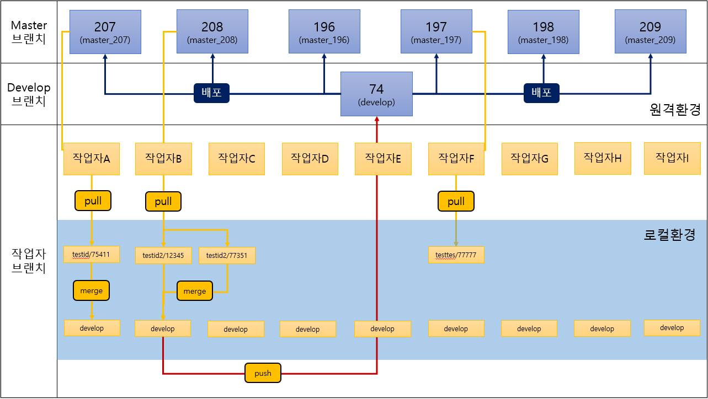

자사 Git 업무 플로우
==========

# 흐름도
> 

## 안내사항 및 주의사항
> 작업용 브랜치는 로컬환경으로 자유롭게 작업하실때 생성 삭제하셔도 무관합니다. (원격 작업자 브랜치로 올릴 브랜치는 형식을 고정합니다.)    
> 실서버 배포(merge request)까지 완료(요청서 종료)된 브랜치는 삭제합니다.    
> commit 메세지는 [요청서번호] 요청서명 을 입력 후 작업한 내용을 간략하게 한줄에서 두줄 요약서술합니다.    

## 1번
> 작업할 파일이 있는 실서버의 master 브랜치에서 코드 받아오기    
> 작업할 작업용 브랜치를 만들고 체크아웃 후 받지 않으면 HEAD가 위치된 브랜치에 받아와집니다.    

## 2번
> 작업용 브랜치의 작업이 끝나면 원격 작업자 브랜치(작업자아이디/요청서번호) 또+는 테스트서버 브랜치(develop)로 push합니다.    

## 3번
> 작업이 끝난 브랜치를 실서버에 병합 요청을 하기 위하여 원격 서버에 업로드합니다. (원격 서버에 해당 브랜치가 생성됩니다)    

## 4번
> 작업이 끝난 브랜치를 실서버에 병합요청합니다.     
> 이때 관리자가 수락을 하면 실서버에 자동으로 수정 및 추가한 코드가 배포됩니다.    

## 5번
> 작업이 끝난 브랜치를 개발브랜치에 push합니다.    
> 개발서버에서 코드의 오류와 문제점을 확인 후 3~4번을 진행합니다.    

## 6번
> 작업용 브랜치입니다. 작업자아이디/요청서번호 형식으로 생성합니다.    
> 해당 브랜치에서 작업합니다.    