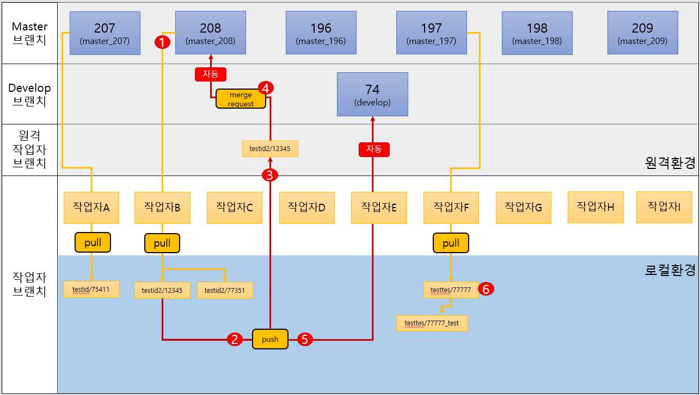

Git 업무 플로우
==========

# 흐름도
> 

## 안내사항 및 주의사항
> 작업용 브랜치는 로컬환경으로 자유롭게 작업하실때 생성 삭제하셔도 무관합니다.
> 로컬 develop 브랜치는 작업 후 병합하기 전 master브랜치에서 반드시 pull을 먼저 받아와 적용 후 병합합니다.
> 실서버 배포(merge request)까지 완료(요청서 종료)된 브랜치는 삭제합니다.

## 1번
> 작업할 파일이 있는 실서버의 master 브랜치에서 코드 받아오기
> 주의 : 작업할 브랜치를 미리 만들고 체크아웃한 뒤 받아와야합니다.    
> 그렇지 않으면 현재 HEAD가 가리키고있는 브랜치에 받아와집니다.

## 2번
> 작업용 브랜치에서 작업 완료 후 테스트서버에 배포하기 전 로컬 테스트 브랜치에 병합합니다.
> 바로 master브랜치의 내용을 작업용 브랜치에 병합하고 테스트서버에 배포해도 되지만 관리의 용이를 위해 한단계 더 거칩니다.
